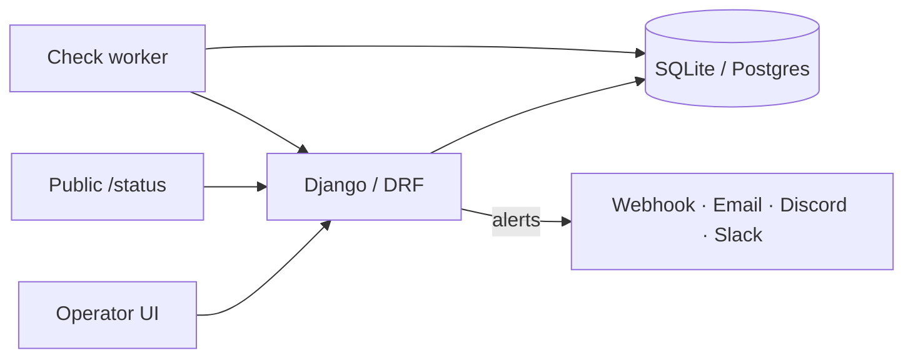

<p align="center">
  
</p>

<p align="center">
  <strong>Watch your APIs. Catch outages early. Ship with confidence.</strong>
</p>

<p align="center">
  <a href="#quick-start"></a>
  <a href="#features"></a>
  <a href="https://github.com/FedericoGabrielCastro/Apollo/actions"></a>
</p>

<p align="center">
  
  
  
  
  
  
</p>

---

## Why Apollo?

Most “health checks” stop at a green ping.  
**Apollo** is a full monitoring cockpit: scheduled probes, transition alerts, incidents, a public status page, charts, and exports — in one Django + React monolith.

```text
   probe ──► assert ──► threshold ──► incident
                │                        │
                └──► webhook / email / Discord / Slack
                └──► public /status page
```

---

## Features

<table>
  <tr>
    <td width="50%">
      <h3>🔭 Probes that mean it</h3>
      <p>HTTP methods, custom headers, bearer/basic auth, request bodies, SSL expiry, latency caps, body / header / JSON-path assertions.</p>
    </td>
    <td width="50%">
      <h3>🚨 Alerts without noise</h3>
      <p>Transition-only notifications, failure thresholds, mute windows, quiet hours. Channels: webhook, email, Discord, Slack.</p>
    </td>
  </tr>
  <tr>
    <td>
      <h3>🩹 Incidents & ownership</h3>
      <p>Auto open/resolve, acknowledge in UI, multi-user ownership, optional registration, staff sees everything.</p>
    </td>
    <td>
      <h3>📣 Status the world can see</h3>
      <p>Public <code>/status</code>, branded title/subtitle/support link, tags, and live overall health.</p>
    </td>
  </tr>
  <tr>
    <td>
      <h3>📈 Ops dashboard</h3>
      <p>Uptime & latency charts, due checks, CSV export, paginated history, check retention.</p>
    </td>
    <td>
      <h3>🧱 Ship-ready stack</h3>
      <p>Poetry, pnpm, Docker Compose (<code>db</code> + <code>web</code> + <code>worker</code>), GitHub Actions CI, WhiteNoise + Gunicorn.</p>
    </td>
  </tr>
</table>

---

## Quick start

### Local (dev)

```bash
cp .env.example .env
poetry install && poetry run python manage.py migrate && poetry run python manage.py seed
pnpm --dir frontend install

# terminal 1
poetry run python manage.py runserver

# terminal 2
pnpm --dir frontend dev
```

| Surface | URL |
|--------|-----|
| **App** | http://localhost:5173 |
| **Public status** | http://localhost:5173/status |
| **Demo login** | `apollo` / `apollo` |

### Docker (one shot)

```bash
cp .env.example .env
docker compose up --build
```

| Surface | URL |
|--------|-----|
| **App + API** | http://localhost:8000 |
| **Status** | http://localhost:8000/status |

Worker runs due checks and prunes old results on an interval.

---

## Architecture



**Monolith layout:** React (Vite) talks to `/api/*`; production serves the built frontend via WhiteNoise.

---

## API map

| Method | Path | Auth |
|--------|------|------|
| `GET` | `/api/health/` | public |
| `GET` | `/api/status/public/` | public |
| `GET/PATCH` | `/api/status/config/` | token |
| `POST` | `/api/auth/login/` · `/api/auth/register/` | public* |
| `GET` | `/api/dashboard/` | token |
| `CRUD` | `/api/endpoints/` | token |
| `GET` | `/api/incidents/?status=open` | token |
| `POST` | `/api/incidents/{id}/acknowledge/` | token |
| `GET` | `/api/exports/{checks\|alerts\|incidents}.csv` | token |

\* Register only if `APOLLO_ALLOW_REGISTER=true`.

---

## Commands

```bash
poetry run pytest
poetry run python manage.py check_endpoints --due
poetry run python manage.py run_check_worker --once
poetry run python manage.py prune_checks --dry-run
pnpm --dir frontend build
docker compose up --build
```

---

## Configuration

Copy `.env.example` → `.env`. Highlights:

| Variable | Purpose |
|----------|---------|
| `DJANGO_SECRET_KEY` | Required when `DJANGO_DEBUG=false` |
| `DATABASE_URL` | Postgres URL (empty → SQLite) |
| `CHECK_INTERVAL_SECONDS` | Worker loop |
| `CHECK_RETENTION_DAYS` | Auto-prune old checks |
| `APOLLO_ALLOW_REGISTER` | Open self-serve signup |
| `EMAIL_*` / mailer settings | Email alerts |

---

## Project pulse

```text
 Apollo
 ├── monitoring/     models · probes · alerts · incidents · status
 ├── config/          Django settings & URLs
 ├── frontend/        React + Redux + Vite UI
 ├── docker/          entrypoint + worker
 └── .github/        CI
```

---

<p align="center">
  <sub>Built as a Django + React monolith · Designed to stay out of the way until something breaks</sub>
</p>

<p align="center">
  
</p>
